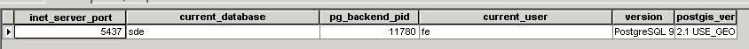
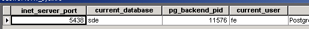
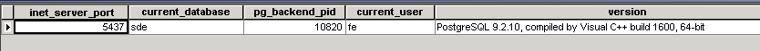

I worked out the issue with the MXD in UAT.  I think it is a bug (related to a known postgres bug) where the re-sourcing the data layers in ArcMap doesn’t actually happen.

After re-sourcing to the UAT database, the MXD would hang when opened on UATAPP08.  When I opened the MXD back on DEVAPP08 and checked the backend database connections one the database server, those connections were coming in on the dev database, not the UAT database.

And I think the issue is a per-process issue.  Check this out.

Our dev database and uat database are on the same server: UATDB04 but on different ports (DEV=5438 and UAT=5437).  On each database, I have a diagnostic view setup (for this sort of occasion) that will echo back the port/database/PID etc.

If I open up UAT database in ArcCatalog, I see the expected “Port 5437 on the  vw\_sysinfo:

If I DRAG that table into the offending MXD in ArcMap, right-click and view:

Ummm…..those values should be exactly the same!!!

I think the bug is that ArcMap does some matching on connection string info already present in the MXD, but they forgot to take into account the port number.  Because if I repeat the process with a blank MXD, I get the expected inet\_server\_port value of 5437:

Interesting enough, I see the behavior in ArcCatalog too. 

So for 10.2, the first port used by ArcMap/ArcCatalog is going to be the port that is used for the duration of the process regardless of the port in an SDE connection (or layer file with connection info).

-jay
